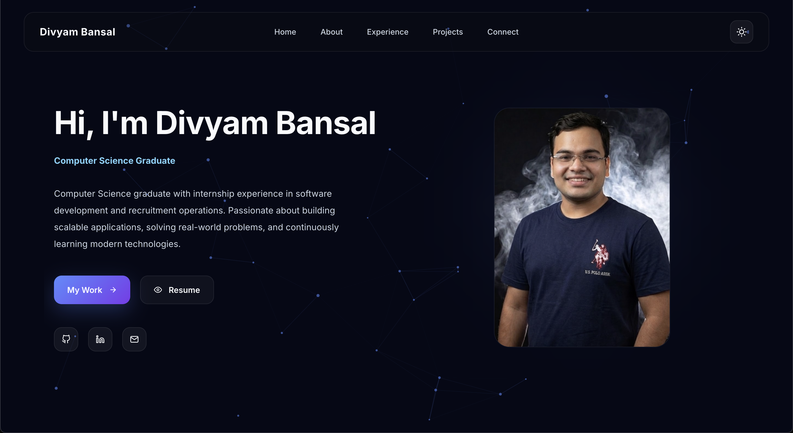

# 🚀 Divyam Bansal - Portfolio

A modern, responsive personal portfolio built using React and Vite to showcase my projects, skills, experience, and professional journey.


## 📸 Preview

<p>
  
</p>

---

## ✨ Features

- Modern and responsive UI
- Smooth animations using Framer Motion
- Interactive particle background
- Dark & Light theme support
- Mobile-first responsive design
- Skills categorization
- Experience timeline
- Project showcase
- Certifications section
- Resume download
- Contact section with social links

---

## 🛠️ Built With

- React
- Vite
- JavaScript
- CSS3
- Framer Motion
- React Icons
- tsParticles

---

## 📂 Project Structure

```text
src/
├── assets/
├── components/
├── context/
├── data/
├── pages/
├── styles/
├── App.jsx
└── main.jsx
```

---

## 📬 Contact

**Divyam Bansal**

Email: divyam08102003@gmail.com

LinkedIn: https://www.linkedin.com/in/div2003/

GitHub: https://github.com/divyam082003
